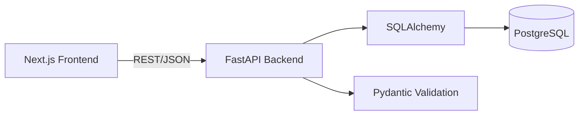
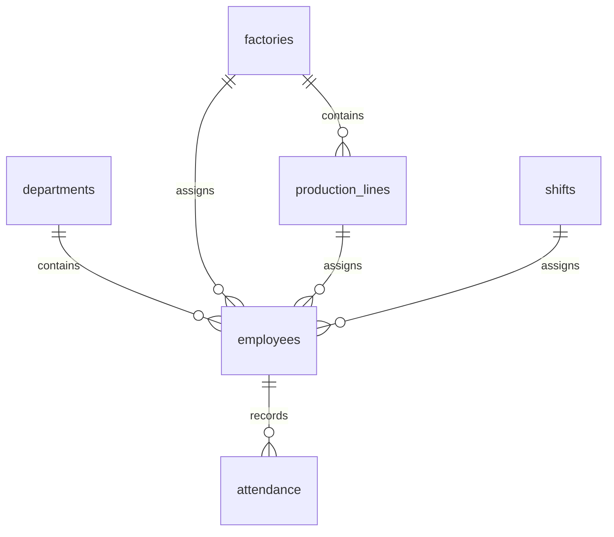

# FactoryHR Lite

> 제조업 인력·근태 데이터를 관리하는 풀스택 HR 운영 웹서비스

FactoryHR Lite는 제조업 현장의 직원, 부서, 생산라인, 교대조, 근태 데이터를 관리하고 기본 인력운영 지표를 확인할 수 있도록 만든 풀스택 웹 프로젝트입니다.

대표작이나 대규모 HR 플랫폼을 목표로 하지 않습니다. 프론트엔드, REST API, 관계형 데이터베이스를 한 사이클로 연결해 CRUD, 검색·필터, 대시보드, 기본 검증, 테스트와 배포 구조를 구현하는 서브 프로젝트입니다.

> 현재 저장소에는 README만 있으며 애플리케이션 코드는 아직 구현되지 않았습니다. 아래 기능과 구조는 구현 예정 범위입니다.

## 1. 프로젝트 한 줄 소개

제조업 현장의 직원 배치와 근태를 관리하고, 부서·공장·생산라인·교대조별 인력운영 지표를 확인하는 간단한 풀스택 서비스입니다.

## 2. 프로젝트 목적

- 직원과 근태 데이터를 PostgreSQL에 저장하고 관계를 명확히 관리합니다.
- FastAPI로 CRUD 중심 REST API를 만들고 Next.js 화면에서 사용합니다.
- 이름과 조직 정보를 기준으로 직원을 검색하고 필터링합니다.
- 집계 API와 Recharts를 사용해 운영 지표를 대시보드로 보여줍니다.
- 중복 사번, 잘못된 근무시간, 퇴사 이후 근태 입력 같은 기본 오류를 서버에서 방지합니다.
- Docker Compose와 GitHub Actions를 사용해 로컬 실행과 테스트 가능한 구조를 마련합니다.

## 3. 주요 기능

### 구현 예정 기능

#### 직원 관리

- 직원 등록, 목록 조회, 상세 조회, 수정, 삭제
- 부서, 공장, 생산라인, 교대조 정보 연결
- 직책, 입사일, 퇴사일, 재직·퇴사 상태 관리

#### 근태 관리

- 날짜별 출근 기록 등록 및 조회
- 근무시간과 잔업시간 기록
- 지각·결근 상태 기록
- 직원별 근태 조회

#### 생산라인·교대조 배치

- 직원별 현재 생산라인과 교대조 관리
- 필요 시 간단한 배치 이력 테이블로 확장

#### 대시보드

- 총 직원 수, 재직 인원, 퇴사 인원
- 평균 근속기간, 결근율, 평균 잔업시간
- 라인별 인원과 교대조별 인원

#### 검색·필터

- 이름 검색
- 부서, 공장, 생산라인, 교대조 필터
- 재직 상태 필터

#### 선택 기능

- 로그인
- `Admin` / `Viewer` 권한 구분
- `Admin`: 직원 등록·수정·삭제
- `Viewer`: 직원 조회와 대시보드 조회

## 4. 화면 구성

구현 예정 화면은 다음과 같습니다.

- **대시보드:** 핵심 KPI 카드와 라인별·교대조별 인원 차트
- **직원 목록:** 검색, 필터, 페이지 단위 조회, 등록·수정·삭제 진입점
- **직원 상세:** 기본 정보, 현재 배치, 직원별 근태 목록
- **근태 관리:** 날짜와 직원 기준의 근태 조회 및 등록
- **로그인:** 선택 기능으로 권한에 따른 화면 접근 제어

## 5. 시스템 아키텍처



요청은 Next.js 화면에서 FastAPI REST API로 전달되고, FastAPI가 Pydantic으로 입력을 검증한 뒤 SQLAlchemy를 통해 PostgreSQL을 조회·변경합니다. 대시보드 지표도 별도 분석 저장소 없이 현재 관계형 데이터에서 집계하는 범위로 시작합니다.

### 프로젝트 구조

```text
factoryhr-lite/
├── frontend/
│   ├── app/
│   ├── components/
│   └── lib/
├── backend/
│   ├── app/
│   │   ├── routers/
│   │   ├── models/
│   │   ├── schemas/
│   │   ├── services/
│   │   └── main.py
│   └── tests/
├── docker-compose.yml
└── README.md
```

## 6. 기술 스택

| 영역 | 기술 |
| :--- | :--- |
| Frontend | Next.js, TypeScript, Tailwind CSS, Recharts |
| Backend | FastAPI, Python, Pydantic, SQLAlchemy |
| Database | PostgreSQL |
| Testing / DevOps | Pytest, GitHub Actions, Docker Compose |

## 7. 데이터베이스 구조

핵심 테이블은 운영에 필요한 범위로 제한합니다.



### 핵심 테이블

- `departments`: 부서 코드와 부서명
- `factories`: 공장 코드와 공장명
- `production_lines`: 공장에 속한 생산라인
- `shifts`: 교대조 코드와 표시명
- `employees`: 직원과 현재 조직·배치 정보
- `attendance`: 직원별 일자 근태 기록

### `employees` 주요 컬럼

`id`, `employee_number`, `name`, `department_id`, `factory_id`, `production_line_id`, `shift_id`, `position`, `hired_at`, `resigned_at`, `status`

### `attendance` 주요 컬럼

`id`, `employee_id`, `work_date`, `work_hours`, `overtime_hours`, `attendance_status`

직원의 라인이나 교대조 변경 이력이 필요해지는 경우에는 `employee_assignments`를 추가합니다. 첫 구현부터 배치 이력을 포함해 테이블 수를 늘리지는 않습니다.

## 8. API

구현 예정 API 예시는 다음과 같습니다.

| Method | Endpoint | 설명 |
| :--- | :--- | :--- |
| `GET` | `/api/employees` | 직원 목록, 검색·필터 조회 |
| `POST` | `/api/employees` | 직원 등록 |
| `GET` | `/api/employees/{id}` | 직원 상세 조회 |
| `PUT` | `/api/employees/{id}` | 직원 정보 수정 |
| `DELETE` | `/api/employees/{id}` | 직원 삭제 |
| `GET` | `/api/attendance` | 근태 목록, 직원·날짜 기준 조회 |
| `POST` | `/api/attendance` | 근태 기록 등록 |
| `GET` | `/api/dashboard/summary` | 대시보드 KPI와 그룹별 인원 집계 |

## 9. 데이터 검증 규칙

Pydantic 스키마와 서비스 계층에서 다음 규칙을 검증할 예정입니다.

- `employee_number`는 중복 등록할 수 없습니다.
- `work_hours`와 `overtime_hours`는 음수일 수 없습니다.
- 근무시간은 비정상적으로 긴 값이 저장되지 않도록 상한을 둡니다.
- 직원의 `resigned_at` 이후 날짜에는 근태를 입력할 수 없습니다.
- 교대조 코드는 `SHIFT_DAY`, `SHIFT_NIGHT`처럼 정해진 형식으로 표준화합니다.
- 직원과 부서·공장·라인·교대조의 외래 키 관계를 확인합니다.

## 10. 실행 방법

현재는 실행 가능한 코드가 없으며, 초기 구현 후 아래 흐름을 목표로 합니다.

```bash
git clone https://github.com/ssg-sak/FactoryHR-Lite.git
cd FactoryHR-Lite
docker compose up --build
```

예정된 로컬 주소는 프론트엔드 `http://localhost:3000`, FastAPI 문서는 `http://localhost:8000/docs`입니다. 환경변수와 마이그레이션 명령은 구현 시 추가합니다.

## 11. 테스트

백엔드의 `backend/tests/`에 Pytest 테스트를 작성할 예정입니다.

- 직원 CRUD와 중복 사번 검증
- 직원 목록 검색·필터
- 근태 등록과 근무시간 검증
- 퇴사일 이후 근태 입력 차단
- 대시보드 집계 결과
- API 오류 응답 형식

GitHub Actions에서는 의존성 설치, 테스트 실행, 기본 코드 검사를 수행하도록 구성합니다.

## 12. 현재 구현 범위

| 항목 | 상태 | 내용 |
| :--- | :---: | :--- |
| README 및 초기 범위 정의 | 완료 | 서비스 목적, 데이터 모델, API와 검증 규칙 정리 |
| Frontend | 개발 예정 | Next.js 화면과 검색·필터·차트 구현 |
| Backend | 개발 예정 | FastAPI CRUD 및 대시보드 API 구현 |
| Database | 개발 예정 | PostgreSQL 스키마와 관계 설정 |
| 검증 및 테스트 | 개발 예정 | Pydantic 검증과 Pytest 테스트 작성 |
| Docker / CI | 개발 예정 | Docker Compose와 GitHub Actions 구성 |
| 로그인 / 권한 | 선택 예정 | 기본 CRUD 이후 필요성을 보고 추가 |

## 13. 한계

- 현재는 코드가 없는 설계 단계이므로 실제 동작 화면, API, 테스트 결과를 제공하지 않습니다.
- 급여, 채용 관리, 전자결재, 교육, 평가, 생산량·품질 데이터는 다루지 않습니다.
- 집계 지표는 저장된 인력·근태 데이터의 정확성과 입력 시점에 의존합니다.
- 실시간 출입기 연동이나 법률·노무 판단을 제공하지 않습니다.
- 로그인과 권한은 선택 범위이며 초기 CRUD 구현 이후 우선순위를 결정합니다.

AI 기능은 필수가 아닙니다. 추가하더라도 현재 KPI를 구조화된 데이터로 Gemini에 전달하고, `관찰된 특징 3개`, `추가 확인이 필요한 데이터`, `현재 데이터만으로 단정할 수 없는 내용`을 반환하는 정도로 제한합니다. 입력 데이터 밖의 사실을 만들거나 인과관계를 임의로 판단하지 않도록 가드레일을 둡니다.

## 14. 향후 개선

- 직원의 공장·라인·교대조 변경을 추적하는 간단한 배치 이력 추가
- 페이지네이션, 정렬, 기간별 대시보드 필터 추가
- 로그인과 `Admin` / `Viewer` 권한 구현
- PostgreSQL 마이그레이션 및 샘플 데이터 시드 추가
- 배포 환경의 환경변수 관리와 CI 기반 테스트 자동화

다음 범위는 현재 계획에 포함하지 않습니다: Redis, GraphQL, Vector DB, LangChain, S3, 급여, ATS, 전자결재, Slack 연동, 복잡한 AI 기능.
